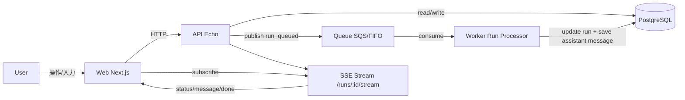

# AI Workspace Platform
日本語 | [English](./README.md)

AIとの対話を「ワークスペース」と「スレッド」で管理し、将来的にワークスペース単位のナレッジを活用できるようにした開発中プロダクトです。

## アーキテクチャ

### 概要

- **Web (`apps/web`)**: Next.js UI。ワークスペース/スレッド操作、メッセージ送信、SSE購読。
- **API (`apps/api`)**: EchoベースのHTTP API。永続化、Run作成、SSE配信エンドポイント提供。
- **Worker (`apps/worker`)**: QueueからRunを処理し、assistantメッセージを保存。
- **DB (PostgreSQL)**: `workspaces`, `threads`, `runs`, `messages`, `workspace_knowledge` を保持。
- **Queue (SQS想定)**: API->Worker間の非同期実行トリガー。

### アーキテクチャ図

### 主要データモデル

- **Workspace**: 会話の論理的な箱。`system_prompt` を持てる。
- **Thread**: Workspace内の会話単位。
- **Run**: 1回の実行単位（`queued/running/succeeded/failed/cancelled`）。
- **Message**: user/assistant発言ログ。
- **WorkspaceKnowledge**: ワークスペースごとのナレッジ（MVPは1:1）。

### 実行フロー（メッセージ送信）

1. Webが `POST /threads/:id/messages` を実行
2. APIがuser message保存 + run作成（queued） + queue publish
3. Workerがrunを処理し、assistant message保存 + run更新
4. APIのSSE (`/runs/:id/stream`) をWebが購読し、結果を反映
