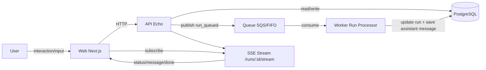

# AI Workspace Platform
[日本語](./README.ja.md) | English

A product in active development that manages AI conversations with workspaces and threads, designed to support workspace-level knowledge usage in future iterations.

## Architecture

### Overview

- **Web (`apps/web`)**: Next.js UI for workspace/thread operations, message posting, and SSE subscription.
- **API (`apps/api`)**: Echo-based HTTP API for persistence, run creation, and SSE streaming endpoints.
- **Worker (`apps/worker`)**: Processes runs from the queue and stores assistant messages.
- **DB (PostgreSQL)**: Stores `workspaces`, `threads`, `runs`, `messages`, and `workspace_knowledge`.
- **Queue (SQS assumed)**: Asynchronous trigger from API to Worker.

### Architecture Diagram

### Core Data Models

- **Workspace**: Logical container for conversations. Can have a `system_prompt`.
- **Thread**: A conversation unit inside a workspace.
- **Run**: One execution unit (`queued/running/succeeded/failed/cancelled`).
- **Message**: User/assistant message log.
- **WorkspaceKnowledge**: Workspace-scoped knowledge (MVP is 1:1).

### Execution Flow (Message Posting)

1. Web calls `POST /threads/:id/messages`
2. API saves the user message + creates a run (`queued`) + publishes to queue
3. Worker processes the run, saves assistant message, and updates run status
4. Web subscribes to API SSE (`/runs/:id/stream`) and reflects updates
