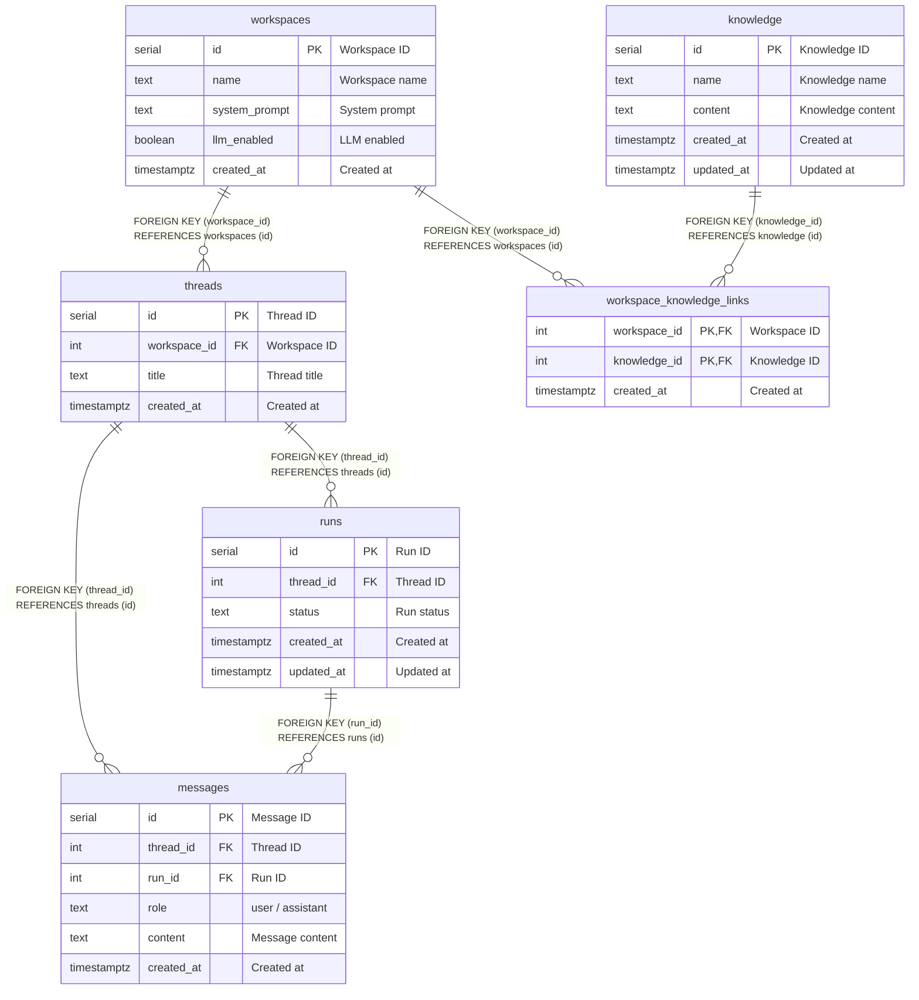

# DB Schema (MVP)
日本語 | [English](./README.md)

MVPのDBは以下の6テーブルで構成します。

- [workspaces](workspaces.md)
- [knowledge](knowledge.md)
- [workspace_knowledge_links](workspace_knowledge_links.md)
- [threads](threads.md)
- [runs](runs.md)
- [messages](messages.md)

## Quick Overview

- **workspaces**: UIの1ペイン（思考空間）を表すルート。
- **knowledge**: ナレッジ本文の実体（独立）。
- **workspace_knowledge_links**: ワークスペースとナレッジの紐付け（多対多）。
- **threads**: ワークスペース内の会話単位（タブ＝スレッド）。
- **runs**: スレッド内でのユーザー入力ごとの実行単位。状態遷移を持つ。
- **messages**: user/assistant の発言ログ。スレッドに紐付く（任意で run にも紐付く）。

## Relations

## Notes

- `runs.status` は `queued / running / succeeded / failed / cancelled`
- `messages.run_id` は Run 未紐付けの履歴がある可能性に備えて nullable
- 並列度は thread 単位（同一 thread 内は直列）
- 将来的に `agents / knowledge / files` など追加予定
