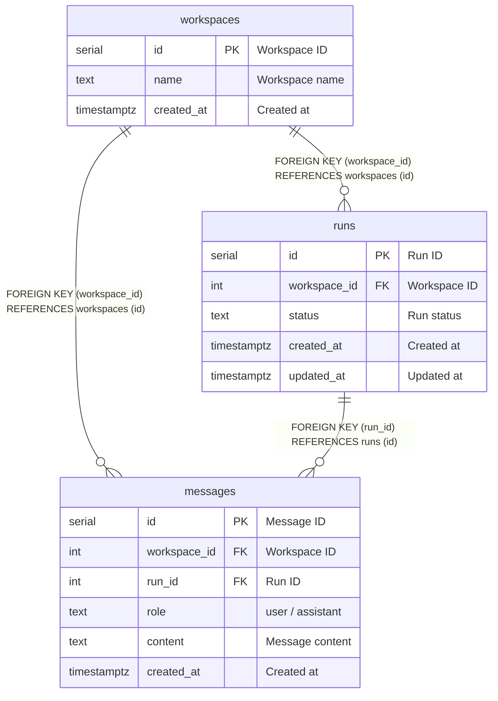

# DB Schema (MVP)

MVPのDBは以下3テーブルのみで構成します。

- [workspaces](workspaces.md)
- [runs](runs.md)
- [messages](messages.md)

## Quick Overview

- **workspaces**: UIの1ペイン（思考空間）を表すルート。
- **runs**: ユーザー入力ごとの実行単位。状態遷移を持つ。
- **messages**: user/assistant の発言ログ。workspaceに紐付く。

## Relations

## Notes

- `runs.status` は `queued / running / succeeded / failed / cancelled`
- `messages.run_id` は Run 未紐付けの履歴がある可能性に備えて nullable
- MVPではシンプル優先。将来的に `agents / knowledge / files` など追加予定
