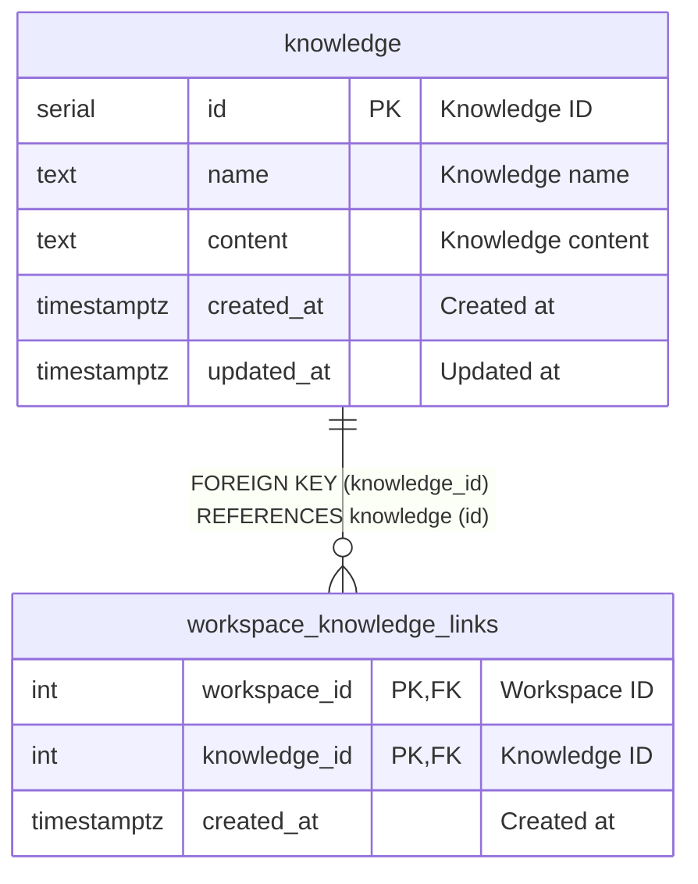

# knowledge

## Description

<details>
<summary><strong>Table Definition</strong></summary>

```sql
CREATE TABLE IF NOT EXISTS knowledge (
  id SERIAL PRIMARY KEY,
  name TEXT NOT NULL,
  content TEXT NOT NULL,
  created_at TIMESTAMPTZ NOT NULL DEFAULT NOW(),
  updated_at TIMESTAMPTZ NOT NULL DEFAULT NOW()
);
```

</details>

## Columns

| Name | Type | Default | Nullable | Extra Definition | Children | Parents | Comment |
| ---- | ---- | ------- | -------- | ---------------- | -------- | ------- | ------- |
| id | serial |  | false | PRIMARY KEY | [workspace_knowledge_links](workspace_knowledge_links.md) |  | Knowledge ID |
| name | text |  | false |  |  |  | Knowledge name |
| content | text |  | false |  |  |  | Knowledge content |
| created_at | timestamptz | now() | false | DEFAULT |  |  | Created at |
| updated_at | timestamptz | now() | false | DEFAULT |  |  | Updated at |

## Constraints

| Name | Type | Definition |
| ---- | ---- | ---------- |
| knowledge_pkey | PRIMARY KEY | PRIMARY KEY (id) |

## Indexes

| Name | Definition |
| ---- | ---------- |
| knowledge_pkey | PRIMARY KEY (id) |

## Relations



---

> Generated manually based on db/schema.sql
