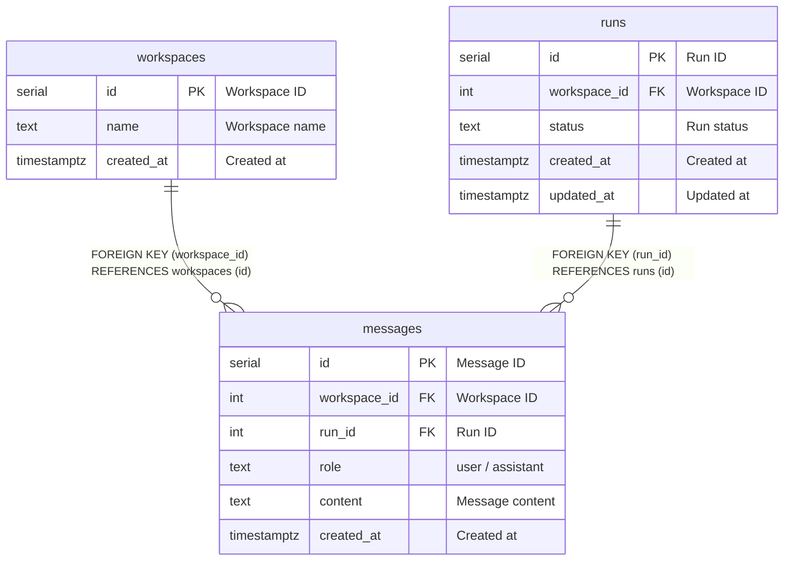

# messages

## Description

<details>
<summary><strong>Table Definition</strong></summary>

```sql
CREATE TABLE IF NOT EXISTS messages (
  id SERIAL PRIMARY KEY,
  workspace_id INTEGER NOT NULL REFERENCES workspaces(id) ON DELETE CASCADE,
  run_id INTEGER REFERENCES runs(id) ON DELETE SET NULL,
  role TEXT NOT NULL CHECK (role IN ('user', 'assistant')),
  content TEXT NOT NULL,
  created_at TIMESTAMPTZ NOT NULL DEFAULT NOW()
);
```

</details>

## Columns

| Name | Type | Default | Nullable | Extra Definition | Children | Parents | Comment |
| ---- | ---- | ------- | -------- | ---------------- | -------- | ------- | ------- |
| id | serial |  | false | PRIMARY KEY |  |  | Message ID |
| workspace_id | integer |  | false |  |  | [workspaces](workspaces.md) | Workspace ID |
| run_id | integer |  | true |  |  | [runs](runs.md) | Run ID (nullable) |
| role | text |  | false | CHECK (user/assistant) |  |  | Message role |
| content | text |  | false |  |  |  | Message content |
| created_at | timestamptz | now() | false | DEFAULT |  |  | Created at |

## Constraints

| Name | Type | Definition |
| ---- | ---- | ---------- |
| messages_pkey | PRIMARY KEY | PRIMARY KEY (id) |
| messages_workspace_id_fkey | FOREIGN KEY | FOREIGN KEY (workspace_id) REFERENCES workspaces (id) ON DELETE CASCADE |
| messages_run_id_fkey | FOREIGN KEY | FOREIGN KEY (run_id) REFERENCES runs (id) ON DELETE SET NULL |
| messages_role_check | CHECK | CHECK (role IN ('user','assistant')) |

## Indexes

| Name | Definition |
| ---- | ---------- |
| messages_pkey | PRIMARY KEY (id) |
| idx_messages_workspace_id | INDEX | INDEX (workspace_id) |

## Relations



---

> Generated manually based on db/schema.sql
