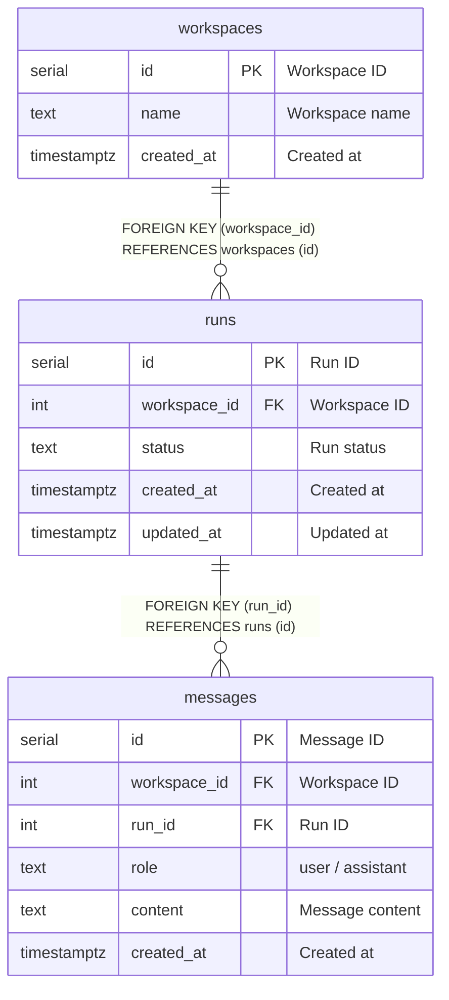

# runs

## Description

<details>
<summary><strong>Table Definition</strong></summary>

```sql
CREATE TABLE IF NOT EXISTS runs (
  id SERIAL PRIMARY KEY,
  workspace_id INTEGER NOT NULL REFERENCES workspaces(id) ON DELETE CASCADE,
  status TEXT NOT NULL CHECK (status IN ('queued', 'running', 'succeeded', 'failed', 'cancelled')),
  created_at TIMESTAMPTZ NOT NULL DEFAULT NOW(),
  updated_at TIMESTAMPTZ NOT NULL DEFAULT NOW()
);
```

</details>

## Columns

| Name | Type | Default | Nullable | Extra Definition | Children | Parents | Comment |
| ---- | ---- | ------- | -------- | ---------------- | -------- | ------- | ------- |
| id | serial |  | false | PRIMARY KEY | [messages](messages.md) |  | Run ID |
| workspace_id | integer |  | false |  |  | [workspaces](workspaces.md) | Workspace ID |
| status | text |  | false | CHECK (queued/running/succeeded/failed/cancelled) |  |  | Run status |
| created_at | timestamptz | now() | false | DEFAULT |  |  | Created at |
| updated_at | timestamptz | now() | false | DEFAULT |  |  | Updated at |

## Constraints

| Name | Type | Definition |
| ---- | ---- | ---------- |
| runs_pkey | PRIMARY KEY | PRIMARY KEY (id) |
| runs_workspace_id_fkey | FOREIGN KEY | FOREIGN KEY (workspace_id) REFERENCES workspaces (id) ON DELETE CASCADE |
| runs_status_check | CHECK | CHECK (status IN ('queued','running','succeeded','failed','cancelled')) |

## Indexes

| Name | Definition |
| ---- | ---------- |
| runs_pkey | PRIMARY KEY (id) |
| idx_runs_workspace_id | INDEX | INDEX (workspace_id) |

## Relations



---

> Generated manually based on db/schema.sql
