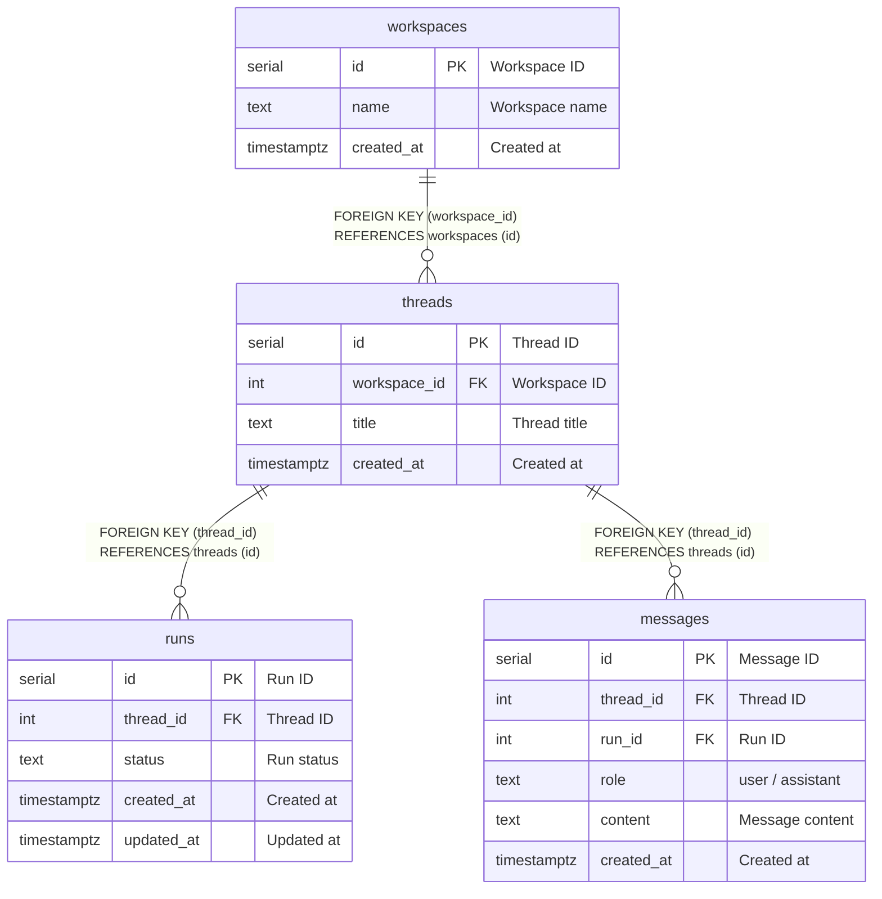

# threads

## Description

<details>
<summary><strong>Table Definition</strong></summary>

```sql
CREATE TABLE IF NOT EXISTS threads (
  id SERIAL PRIMARY KEY,
  workspace_id INTEGER NOT NULL REFERENCES workspaces(id) ON DELETE CASCADE,
  title TEXT,
  created_at TIMESTAMPTZ NOT NULL DEFAULT NOW()
);
```

</details>

## Columns

| Name | Type | Default | Nullable | Extra Definition | Children | Parents | Comment |
| ---- | ---- | ------- | -------- | ---------------- | -------- | ------- | ------- |
| id | serial |  | false | PRIMARY KEY | [runs](runs.md), [messages](messages.md) |  | Thread ID |
| workspace_id | integer |  | false |  |  | [workspaces](workspaces.md) | Workspace ID |
| title | text |  | true |  |  |  | Thread title (optional) |
| created_at | timestamptz | now() | false | DEFAULT |  |  | Created at |

## Constraints

| Name | Type | Definition |
| ---- | ---- | ---------- |
| threads_pkey | PRIMARY KEY | PRIMARY KEY (id) |
| threads_workspace_id_fkey | FOREIGN KEY | FOREIGN KEY (workspace_id) REFERENCES workspaces (id) ON DELETE CASCADE |

## Indexes

| Name | Definition |
| ---- | ---------- |
| threads_pkey | PRIMARY KEY (id) |
| idx_threads_workspace_id | INDEX | INDEX (workspace_id) |

## Relations



---

> Generated manually based on migrations

