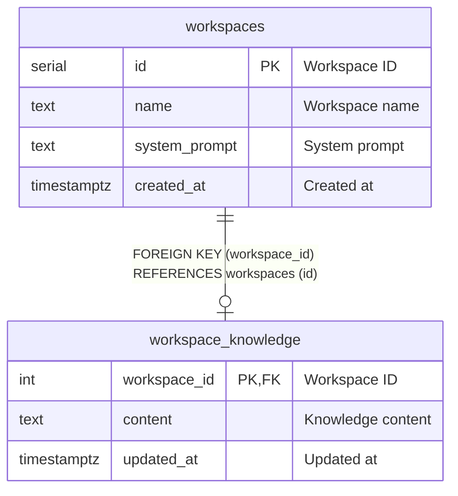

# workspace_knowledge

## Description

<details>
<summary><strong>Table Definition</strong></summary>

```sql
CREATE TABLE IF NOT EXISTS workspace_knowledge (
  workspace_id INTEGER PRIMARY KEY REFERENCES workspaces(id) ON DELETE CASCADE,
  content TEXT NOT NULL,
  updated_at TIMESTAMPTZ NOT NULL DEFAULT NOW()
);
```

</details>

## Columns

| Name | Type | Default | Nullable | Extra Definition | Children | Parents | Comment |
| ---- | ---- | ------- | -------- | ---------------- | -------- | ------- | ------- |
| workspace_id | integer |  | false | PRIMARY KEY |  | [workspaces](workspaces.md) | Workspace ID |
| content | text |  | false |  |  |  | Knowledge content |
| updated_at | timestamptz | now() | false | DEFAULT |  |  | Updated at |

## Constraints

| Name | Type | Definition |
| ---- | ---- | ---------- |
| workspace_knowledge_pkey | PRIMARY KEY | PRIMARY KEY (workspace_id) |
| workspace_knowledge_workspace_id_fkey | FOREIGN KEY | FOREIGN KEY (workspace_id) REFERENCES workspaces(id) ON DELETE CASCADE |

## Indexes

| Name | Definition |
| ---- | ---------- |
| workspace_knowledge_pkey | PRIMARY KEY (workspace_id) |

## Relations



---

> Generated manually based on db/schema.sql
